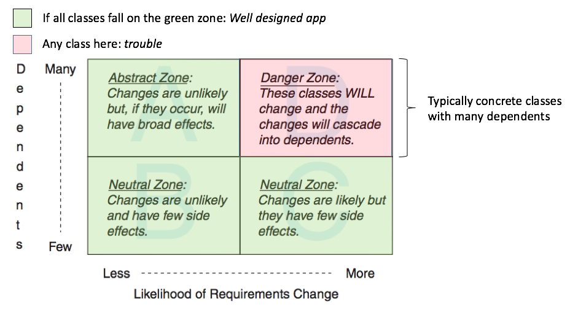

# Sandi Metz's Practical Object Oriented Design in Ruby Method

## Chapter 2: Designing classes with a single responsibility
  A class should do the _smallest possible useful_ thing.
1. Ask what the class does, not what data it has
2. Can you define the class in **one** sentence ?
3. To define the methods that fit into a class, interogate it and see if it makes sense :
 Mr Gear, what is your ratio ? Makes sense, ok.
 Mr Gear, what are your inches ? not as much

### Make code that is easy to change,
 how ? by relying on its behavior, not data!
  Each behaviour depends on **one** method (DRY)
  Hide instance variables, even from methods of the same class (Encapsulation), use accessors, that way, if data is reference d all over, you can change it's definition in one place (the accessor) instead of everywhere.(secret service: no one should know your real name or who you are, even if they might work for the same employer)

  if you identify a method that doesn't neatly fit into your class but isn't a class either, **isolate it**, for example in a structure.

## Chapter 3: Managing dependencies

  _An object depends on another object if, when one object changes, the other might be forced to change in turn_

  ### Recognizing dependencies:
  An object has a dependency when it knows: 
    1. The name of another class
    2. The name of a message to an object other than self
    3. The arguments that message requires
    4. The order of these arguments
  A class should know **just enough** to do its job and nothing more.

  ### Techniques that reduce dependency:
    1. Dependency injection:
      Creating the dependencies of a class (rim, tire) outside of a class(Gear). These dependencies will be injected into the class through 
      1. constructor injection (Wheel.new(rim, tire))
      2. getter/setter injection
      3. interface injection
    2. Isolate instance creation:
      If you can't inject a class into another (wheel as a parameter to Gear.new), isolate it within the class, that way you expose the dependency while reducing its reach into the class.
    3. Isolate message in its own method
    4. Remove argument order dependency
      Use a hash
    5. Provide default values
    6. Reverse dependency:
      
      > Depend on things that change less often than you do

      How to choose what to depend upon ?
      1. Some classes are more likely than others to have changes in requirements:
      
        Your code changes > Your framework's > Ruby base classes' (array, string, int...)
      2. Concrete classes are more likely to change than abstract classes
        Depending on a class that calls diameter is better than 
        depending on a Wheel instance specifically. It allows us to respond to any object that calls .diameter
      3. Changing a class that has many dependents will result in widespread consequences.
        A class with dependents will be under enormous pressure not to change, you will try to bypass making changes and your app will suffer.

        
